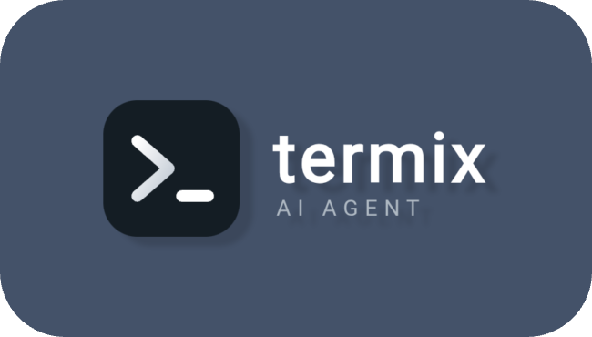

<p align="center">
  
</p>

<h1 align="center">Aulthium</h1>

<p align="center">
  <strong>Your AI coding agent, right inside your terminal.</strong>
</p>

<p align="center">
  Write code. Fix bugs. Read files. Run commands. Search the web.<br>
  <strong>You stay in control.</strong>
</p>


<p align="center">
  <a href="https://github.com/d3stiny-io/aulthium/stargazers">
    
  </a>
  <a href="https://github.com/d3stiny-io/aulthium/blob/main/LICENSE">
    
  </a>
  <a href="https://github.com/d3stiny-io/aulthium/releases">
    
  </a>
</p>

<p align="center">
  
</p>


<p align="center">
  <a href="#-quick-start">Quick Start</a> •
  <a href="#-features">Features</a> •
  <a href="#-real-time-web-search">Web Search</a> •
  <a href="#-contributing">Contributing</a>
</p>

---

## ⚡ Code at the speed of thought

You already have a terminal.

Now give it an AI.

**Aulthium** is a free, open-source AI coding assistant built to work directly from your terminal. Describe what you want in natural language and let the agent help you understand, create, edit, debug, and work with your code.

It can also search the web for fresh information and use those search results when reasoning about your request.

No giant IDE.  
No mandatory subscription.  
No locked-in AI provider.

Just your terminal, your API key, and an AI coding agent.

> 🛡️ **AI proposes. You stay in control.**

---

## 🚀 Quick Start

Start Aulthium with one command:

```bash
bash <(curl -fsSL https://raw.githubusercontent.com/d3stiny-io/aulthium/main/aulthium.sh)
```

The script starts **Aulthium directly**.

There is no separate installation step or launcher command required for this startup method.

### 🔌 Choose Your Provider

When Aulthium starts, it gives you the available AI provider choices supported by the current version.

Choose the provider you want to use, provide the required configuration, and continue.

The basic flow is:

```text
Run aulthium.sh
        │
        ▼
Aulthium starts
        │
        ▼
Choose AI provider
        │
        ▼
Configure provider
        │
        ▼
Agent starts
        │
        ▼
Chat with your coding agent
```

**One command → choose your provider → start coding.**

---

## 💬 Talk to Your Code

You don't need to memorize commands for every task.

Just tell Aulthium what you want.

### 💻 Build

> Create a REST API using Express with authentication and a SQLite database.

### 🐛 Debug

> Find the TypeScript errors in this project and fix them.

### ✏️ Refactor

> Refactor this function to use async/await instead of callbacks.

### 📚 Understand

> Explain what this regex does and suggest a safer alternative.

### 🔍 Search

> Search the web for the latest documentation about this error.

Aulthium can use the information it finds on the web as additional context while working on your request.

---

## ✨ Features

| Feature | Description |
| :--- | :--- |
| 🤖 **Natural Language Coding** | Describe what you want and let the AI work through the task. |
| 📝 **Read & Edit Files** | Read, create, modify, and refactor files in your project. |
| 🗂️ **Project Awareness** | Work with the files and structure of your current workspace. |
| ⚡ **Shell Commands** | Execute commands and scripts when needed, with your approval. |
| 🔧 **Debug & Fix** | Analyze errors, logs, and failed commands to help find solutions. |
| 🔍 **Real-Time Web Search** | Search the web for current technical information and documentation. |
| 🧠 **Web-Aware Reasoning** | Use web-search results as context while reasoning about your task. |
| 🔌 **Bring Your Own Provider** | Choose your supported AI provider and use your own API key. |
| 🔗 **HTTPS MCP Support** | Connect to MCP servers through HTTPS and give Aulthium access to additional tools and services. |
| 📜 **Bash-Based** | The core agent is distributed as a portable Bash script. |
| 🛡️ **Human-in-the-Loop** | Actions requiring execution are presented for your approval. |
| 🔒 **Zero Telemetry** | No built-in proprietary tracking or analytics. |
| 🆓 **Free & Open Source** | Open source and licensed under GPL-3.0. |

---

## 🔍 Real-Time Web Search

Sometimes an AI's built-in knowledge isn't enough.

Documentation changes.

APIs change.

Packages change.

Frameworks change.

Errors change.

**Aulthium can search the web when it needs fresh information.**

You can ask it things like:

> Search the web for the latest documentation for this framework.

Or:

> Search the web for a solution to this error.

The search results can then be **read and used as context by the AI**.

Useful for:

- 📚 Current documentation
- 🔧 Debugging
- 📦 Package information
- 🌐 API references
- 🆕 Recent changes
- 🧩 Unfamiliar errors
- 💡 Finding possible solutions

---

## 🔗 MCP Support

Aulthium now has **MCP (Model Context Protocol) support over HTTPS**.

This allows Aulthium to connect to compatible MCP servers through HTTPS and use the tools they expose, extending what the agent can do beyond its built-in capabilities.

With MCP, Aulthium can work with external tools and services through supported HTTPS MCP endpoints.

### 🌐 HTTPS-Only MCP

The current implementation focuses on **HTTPS-based MCP connections**.

It does not yet provide full MCP support across every transport or use case, but the current implementation is already working well and is actively being improved.

> 🧪 **MCP support is currently experimental.** Some features may still have bugs or limitations.

Current focus:

- 🔗 Connect to MCP servers through HTTPS
- 🧰 Discover and use supported MCP tools
- 🧠 Allow the AI to reason with tool results
- 🌐 Extend Aulthium with external services
- 🛠️ Continue improving compatibility and reliability

As MCP support matures, more capabilities and transports may be added.

---

## 🛡️ You Stay in Control

Aulthium is designed around **human-in-the-loop execution**.

The AI can figure out what it thinks should happen, but actions that affect your environment are not something you should blindly trust.

When Aulthium needs to execute a command, you can review it before allowing it to run.

For example:

```text
Aulthium> ❯ shell command


┌─ ❯ SHELL RUN ────────────────────────────────────────────────                                             │ cwd: /storage/emulated/0/Download/aulthium-workspace
│ npm install express
└────────────────────────────────────────────────     ⚠ This is NOT sandboxed to the workspace folder — it runs with your normal shell privileges.
? Run this command? [y/N] 
```

You decide whether to continue.

> **The AI can suggest the action. You approve it.**

Always review commands and file changes before approving them, especially when working with important projects or sensitive files.

---

## 🔌 Bring Your Own AI Provider

Aulthium is built around the idea that **you should choose how your AI is powered**.

Depending on the current version, you can choose from supported providers such as:

- OpenRouter
- OpenAI
- OpenAI-compatible providers

Your API key belongs to you.

Your provider is your choice.

Your model selection is yours.

Aulthium doesn't require you to use one proprietary AI platform.

---

## 📱 Terminal First

Aulthium is made for environments where a terminal is already available.

Supported environments include:

- 🐧 Linux
- 🍎 macOS
- 📱 Termux on Android

That makes it possible to use an AI coding assistant even when you're working from a mobile terminal.

---

## 📜 Lightweight by Design

The core project is centered around:

```text
aulthium.sh
```

The goal is to keep Aulthium straightforward and portable rather than turning it into a large desktop application.

Despite its lightweight Bash-based core, Aulthium is growing beyond basic terminal automation with features such as web search and HTTPS-based MCP support.

You can start it directly with:

```bash
bash <(curl -fsSL https://raw.githubusercontent.com/d3stiny-io/aulthium/main/aulthium.sh)
```

Minimal setup.

Terminal-first.

Open source.

---

## 🆚 Why Aulthium?

| | Aulthium | Traditional Tools |
| :--- | :--- | :--- |
| 💰 **Cost** | Free software + your provider's API costs | May require subscriptions |
| 🔌 **AI Provider** | Bring your own | Often tied to a platform |
| 🖥️ **Interface** | Terminal | Often desktop / IDE focused |
| 📦 **Startup** | One command | Can require more setup |
| 🌐 **Web Search** | Built into the agent | Depends on the tool |
| 🔗 **MCP** | HTTPS-based MCP support | Depends on the tool |
| 🔓 **Source** | Open source | Often proprietary |
| 🛡️ **Control** | User approval for actions | Depends on the tool |
| 📱 **Termux** | Supported | Often unavailable |
| 📊 **Telemetry** | Zero built-in telemetry | Varies by product |

---

## 🧠 The Vibe-Code Story

> **Built with vision. Powered by AI. Improved by humans.**

Full disclosure: Aulthium is a vibe-coded project.

The creator does not manually write every line of raw syntax. The project is driven by product vision, experimentation, constraints, user experience, and safety requirements, while LLMs generate much of the implementation.

That makes Aulthium an experiment in AI-assisted software development itself.

And because of that, the code may not always be perfect.

The project is actively evolving, especially as newer capabilities such as HTTPS MCP support are being integrated.

You might find:

- Unoptimized logic
- Strange edge cases
- Features that need refinement
- Bugs that need fixing
- Experimental functionality that may behave unexpectedly

That's part of the experiment.

If you find something that could be better:

**Don't just complain about it. Improve it.**

Open an issue.

Submit a pull request.

Help make Aulthium better.

---

## 🧪 Current Status

Aulthium is **actively evolving**.

Core agent functionality is working, while newer features such as **HTTPS MCP support** are still being refined. MCP is already greatly functional, but it is **not completely bug-free yet**.

If you use experimental features, keep that in mind and report anything that behaves unexpectedly.

---

## 🤝 Contributing

Aulthium is open source and contributions are welcome.

Found a bug?

👉 [Open an issue](https://github.com/d3stiny-io/aulthium/issues)

Have an improvement?

👉 [Submit a pull request](https://github.com/d3stiny-io/aulthium/pulls)

Have an idea?

**Let's build it.**

---

## 📋 Requirements

- **OS:** Linux, macOS, or Termux (Android)
- **Shell:** Bash
- **Network:** Internet connection
- **Dependency:** `curl`
- **API Key:** Required for the AI provider you select

---

## 📄 License

Aulthium is licensed under the **GPL-3.0 License**.

See the [LICENSE](https://github.com/d3stiny-io/aulthium/blob/main/LICENSE) file for the complete license text.

---

<p align="center">
  <strong>Built with vision. Powered by AI. Improved by humans.</strong>
</p>

<p align="center">
  If Aulthium is useful to you, consider giving it a star. ⭐
</p>
